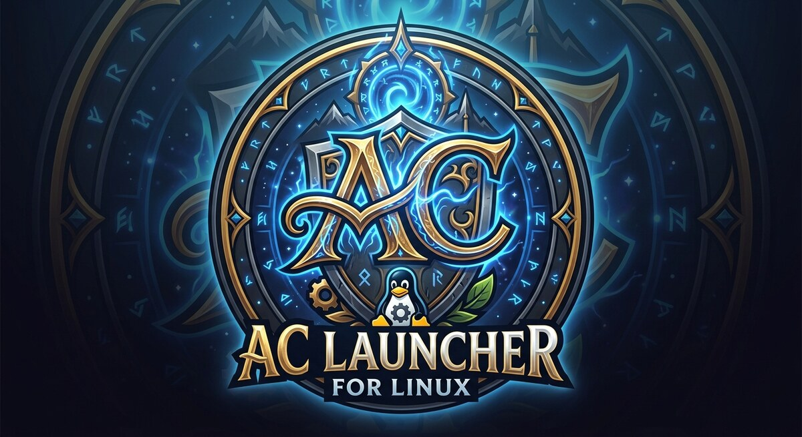

# AC Launcher



A native Linux launcher for Asheron's Call on emulator servers (ACE and GDLE).

AC Launcher keeps your accounts and servers in one place and starts one or many game clients with a single
click. The Windows game client runs through [umu-launcher](https://github.com/Open-Wine-Components/umu-launcher),
which runs Proton without Steam, so no Steam install is needed.

## Features

- **Accounts** — save any number of accounts and tick the servers each one should launch on.
- **Multi-launch** — press Launch (or F5) to start every ticked account on every ticked server, one after another
  with a configurable pause; each running client can be stopped on its own.
- **Server lists** — the community-published server lists are downloaded and cached, so the launcher still works
  offline. Add your own servers, copy a published one to customise it, or hide the ones you never use.
- **Server status** — each server is checked in the background and shown as up or down, with its response time.
- **Proton without Steam** — pick any version of GE-Proton or UMU-Proton (Valve's Proton), from the latest back to
  older releases, or follow the latest automatically. Downloads are checked against their published checksums and
  kept in the launcher's own folder; Proton builds already on the computer can be used too. The launcher keeps
  its own Wine prefix.
- **Windowed start** — optionally sets the client to start in a window, which avoids the fullscreen DirectX error
  many systems hit on first launch.
- **Log window** — everything the launcher, umu and Proton report, in one place.

## Requirements

- Linux (x86-64) with a Vulkan-capable graphics driver.
- An installed Asheron's Call client: the folder that holds `acclient.exe` and the `.dat` files.
- umu-launcher. If it is not installed (for example `pacman -S umu-launcher` on Arch), AC Launcher downloads umu's
  self-contained release on first launch; that release needs `python3`.

The first launch downloads the Steam Linux Runtime and Proton, about 1 GB, once.

## Installing

Downloads are on the [releases page](https://github.com/codingncaffeine/AC-Launcher/releases).

- **Debian / Ubuntu** — `sudo apt install ./ac-launcher_<version>_amd64.deb`
- **Arch Linux** — install `ac-launcher-bin` from the AUR, e.g. `yay -S ac-launcher-bin`
- **Any distribution** — extract `ac-launcher-<version>-linux-x64.tar.gz` and run `ACLauncher` inside it

## Getting started

1. Start AC Launcher and choose your **Asheron's Call folder** at the bottom of the window.
2. **Add account**, then expand it and tick the servers it should play on.
3. Press **Launch**.

## Where things are kept

| What | Where |
| --- | --- |
| Settings, accounts, your servers | `~/.config/ac-launcher/` (`accounts.json` is readable only by you) |
| Wine prefix, Proton versions, umu copy | `~/.local/share/ac-launcher/` |
| Cached server lists | `~/.cache/ac-launcher/` |
| Log | `~/.local/state/ac-launcher/logs/` |

The client stores its own settings in the prefix, under
`drive_c/users/steamuser/Documents/Asheron's Call/UserPreferences.ini`.

## Security

- **Passwords live in your desktop keyring** (GNOME Keyring, KWallet, KeePassXC) when one is available, and are
  otherwise kept in `accounts.json`, readable only by you. They are masked in the log.
- **Every download is verified**: Proton builds against their published checksums (builds that publish none cannot
  be installed), and umu-launcher against GitHub's SHA-256 digest. Server lists are only fetched over HTTPS.
- **The launcher's files and folders are private to your user.**
- **One limit comes from the game itself:** the client takes the password on its command line, so other users on
  the same computer can see it while the game runs.

Details, and how to report a vulnerability, are in [SECURITY.md](SECURITY.md).

## Hardening details

### Credentials

- Passwords are stored through the freedesktop Secret Service with libsecret's `secret-tool`, which receives them on
  standard input — never on a command line where other users could read them.
- Without a keyring, passwords stay in `accounts.json` (mode `0600`). Passwords already in that file move into the
  keyring as soon as one is available; the keyring copy is written before the file copy is removed.
- The launcher masks the account password in everything it logs, including the output of umu-launcher, Proton and
  Wine.

### Downloads and network

- **Proton** releases are verified against their `.sha512sum` file and GitHub's SHA-256 digest — both, when both are
  published. Releases that publish neither are listed but refused. Archives are downloaded and unpacked in a staging
  folder (`tar --no-same-owner`) and only moved into place once verified; a failed or cancelled install leaves
  nothing behind.
- **umu-launcher**'s self-contained release is verified against GitHub's SHA-256 digest, and unpacked with .NET's tar
  reader, which refuses entries that would land outside the destination.
- **Server lists** are only fetched over HTTPS — a list decides where accounts send their passwords. Lists are
  parsed with DTD processing disabled and an 8 MB limit, and any response read whole is capped at 16 MB.
- **Links** from lists or typed in are only opened if they are `http` or `https` links, so a list cannot make the
  launcher open a local file or another URL handler.

### Files

- The launcher's folders are created with mode `0700` and every file it writes with `0600`; folders and files left
  readable by an earlier version are tightened on start.
- Settings are written to a new temporary file (created exclusively, so it cannot follow a planted file or link)
  and renamed into place.

### Build and supply chain

- NuGet lock files record every package with its content hash. CI and release builds restore in locked mode, which
  fails if a dependency changes without its lock file or a package's content differs from its recorded hash.
- Packages are audited for known vulnerabilities on every restore; the .NET security analyzers run on every build
  with warnings treated as errors.
- CI builds, runs the test suite, checks for vulnerable packages and runs ShellCheck on every push.

### Release packages

- Every release package is installed into clean Ubuntu 24.04, Debian 13 and Arch Linux systems with only its declared
  dependencies, then checked: every linked and runtime-loaded library present, the app launched, HTTPS working.
- The `.deb` passes `lintian` with no errors or warnings. Its only overrides cover libraries that SkiaSharp and the
  .NET runtime link statically.
- The AUR `PKGBUILD` passes `namcap` with no errors or warnings.
- Only the launcher and the runtime's `createdump` are executable. The shipped native binaries are position-independent
  with non-executable stacks, and the SkiaSharp libraries are stripped.

### Known limitations

- The game client takes the password on its command line, so other users on the same computer can read it from the
  process list while the game runs.
- `PROTON_LOG` makes Proton write the game's command line, including the password, to a log file; the launcher warns
  when it is set.
- The game client and Proton run with your user's permissions; the launcher does not sandbox them.

## Building

Requires the .NET 10 SDK.

```sh
dotnet build ACLauncher.slnx -c Release
./src/ACLauncher/bin/Release/net10.0/ACLauncher
```

Run the tests with `dotnet run --project tests/ACLauncher.Tests -c Release`.

## Acknowledgements

Inspired by ThwargLauncher, the Windows launcher for Asheron's Call emulator servers.
